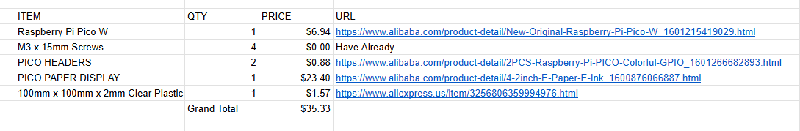

# E-INK-WEATHER-STATION

This project will use a 4.2in E-Ink Waveshare display (Raspbarry Pico Edition), Raspberry Pico W, and a 3d printed shell to hold all the major components.

WHY?: I wanted an easier way to just look at the time and weather without taking out my phone or asking someone else nearby, one of the main reasons being my phone additction :( 

Challenges:
The hardest part seems to be on how to get the basis of the coding, for most of my projects before I focused on the hardware part more but I think its time for me to learn coding through this, I hope this works.

# BOM  

# 3D Rendering / Predictions

# Schematics

MISSING COMPONENTS LIKE RESISTORS THAT ARE PRESENT ON ACTUAL PI PICO WAVESHARE DISPLAY BECAUSE THE FOOTPRINT THAT I FOUND FOR THE DISPLAY SEEMED TO ONLY HAVE THE OTHER VARIANTS. I HAVEN'T LEARNED HOW TO CREATE A FOOTPRINT FOR SPECIFIC ITEMS AND THERE IS NO PICO PAPER ONES OUT THERE

# Shell Iterations:

FINAL FOR NOW

  FRONTSIDE
 
  
  

  BACKSIDE
  
  
  
